# Teetoise↗ Frontend

> **Responsive, SEO‑optimized React application for a scalable e‑commerce platform.**

---

## Tech Stack

- React (v18)
- Redux Toolkit for state management
- React Router v6 for routing
- Axios with a centralized instance and interceptors
- React Helmet for dynamic `<head>` tags (SEO)
- React.lazy & Suspense for code splitting and lazy loading
- React‑Toastify for in‑app notifications
- SCSS modules for styling
- AWS Amplify & Google Cloud Storage for asset hosting
- Custom Error Boundaries for graceful error handling
- Utilities: ScrollToTop, SessionExpired handler

---

## Installation

1. **Clone the repository**

   ```bash
   git clone https://github.com/Raj0168/teetoise-frontend.git
   cd teetoise-frontend
   ```

2. **Install dependencies**

   ```bash
   npm install
   ```

3. **Set up environment variables**
   Create a `.env` file in the root:

   ```ini
   REACT_APP_API_BASE_URL=https://api.teetoise.com
   REACT_APP_ASSETS_URL=https://storage.googleapis.com/your-bucket
   ```

4. **Run in development mode**

   ```bash
   npm start
   ```

5. **Build for production**

   ```bash
   npm run build
   ```

---

## Repository Structure

```
src/
├── components/         # Reusable UI components
│   ├── commons/        # Header, Footer, SessionExpired, ErrorBoundary
│   ├── home/           # FeaturedProducts, NewArrivals, ShopByOccasion
│   ├── payment/        # PaymentButton, displayRazorpay
│   ├── product-details/# TermsOfService, ReturnAndExchange, FAQ, etc.
│   └── blogs/          # BlogPage, BlogDetailsPage
│
├── pages/              # Route-level pages
│   ├── HomePage.js
│   ├── ProductsPage.js
│   ├── ProductDetailsPage.js
│   ├── WishlistPage.js
│   ├── CartPage.js
│   ├── AddressAndOrderSummary.js
│   ├── OrderConfirmationPage.js
│   ├── UserOrdersPage.js
│   ├── OrderDetailsPage.js
│   ├── PaymentFailedPage.js
│   ├── AuthPage.js
│   ├── YourAccount.js
│   └── admin/          # DeveloperPortalPage, AdminLogin
│
├── redux/              # Redux slices and store
│   ├── slices/         # productsSlice.js, userSlice.js, orderSlice.js, etc.
│   └── store.js        # Redux store configuration
│
├── utils/              # Utility functions
│   ├── axiosInstance.js# Axios base instance with interceptors
   ├── ScrollToTop.js   # Scroll restoration component
   └── errorBoundary.js # Custom error boundary component
│
├── App.js              # Application root, Router, Layout, Helmet
└── index.js            # Entry point
```

---

## UI Showcase

All screenshots are taken from the live version of the application before it was taken offline. The application was fully responsive and production-ready.

### Login Page

User login screen with email/password. 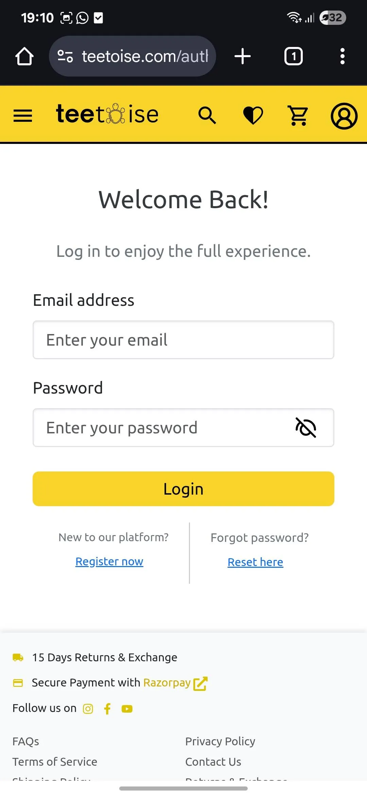

### Register Page

User registration screen with input validation. 

### Home Page – Banner and Promotions

Landing page with promotional banners and featured collections. 

### Home Page – Featured Products

Section showcasing trending and new arrival items. 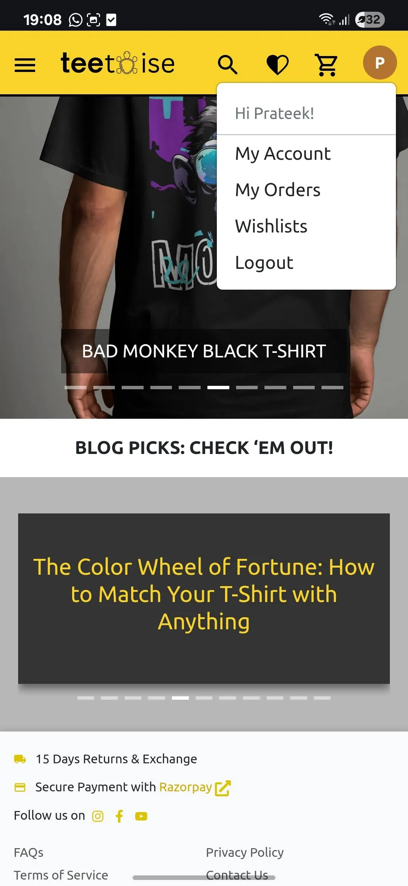

### Sidebar Navigation

Accessible sidebar menu optimized for mobile users. 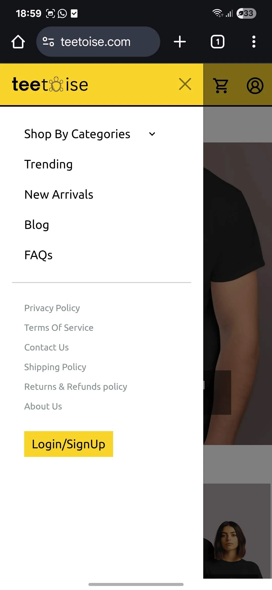

### Product Overview

Grid layout of product listings with filters. 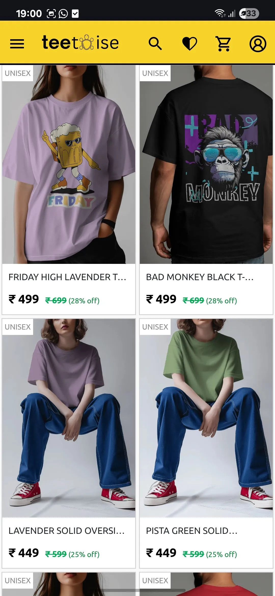

### Product Details Page

Detailed product information with image gallery and color, size options. 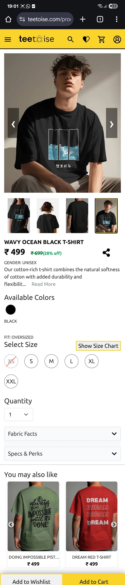

### Product Filters

Category, price range, and size filters. 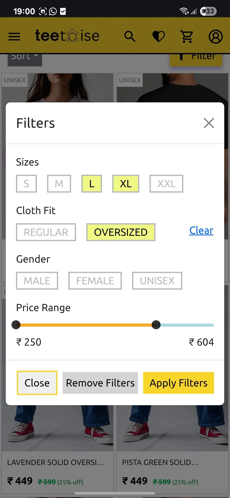

### Alternate Product View

Product manufacturer and quality details. 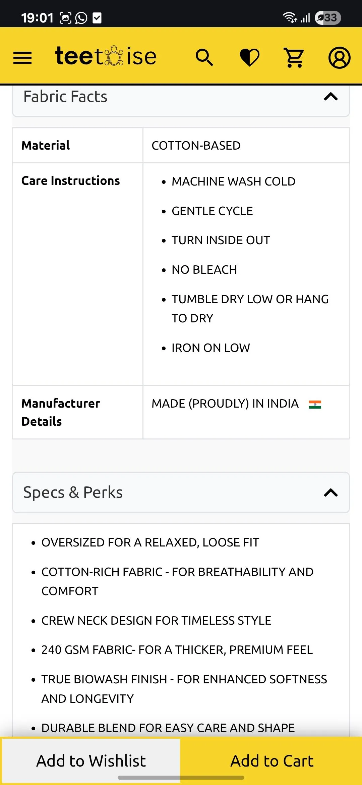

### Wishlist Page

View and manage all saved products. 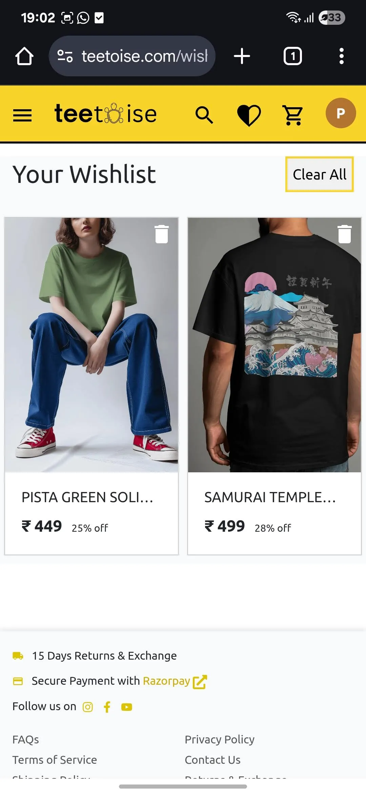

### Cart Page

Interactive cart with quantity, variant, and size management. 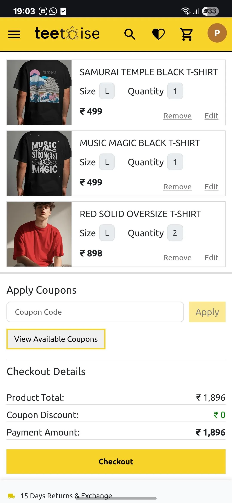

### Checkout Page

Delivery address input and summary before payment. 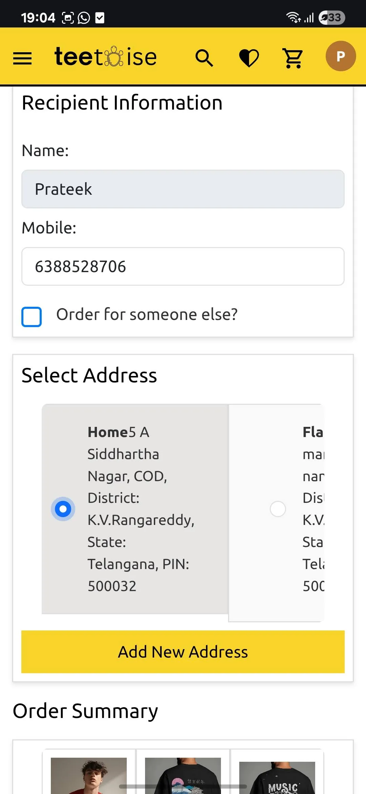

### Payment Gateway

Razorpay integration for secure transactions. 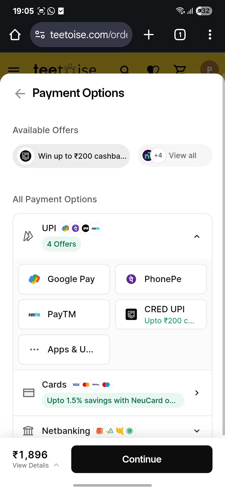

### Orders Overview

List of all past orders. 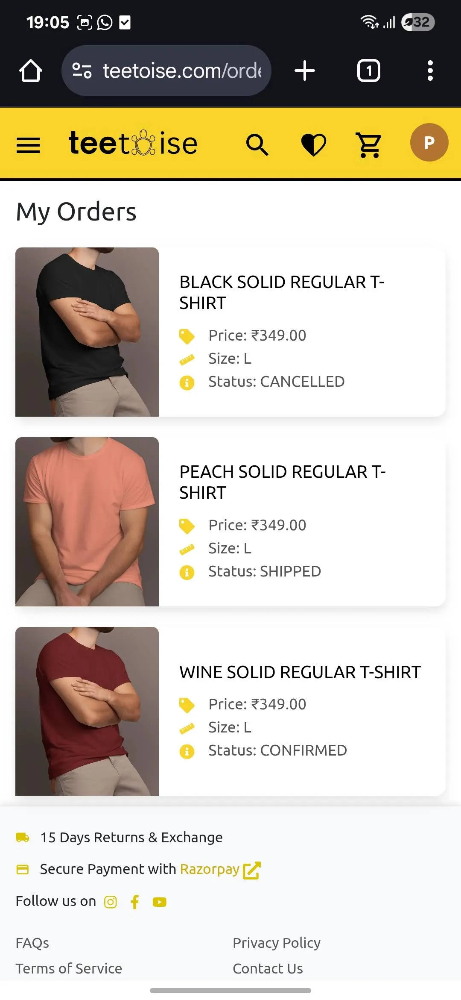

### Order Details Page

In-depth view with delivery status and item breakdown. 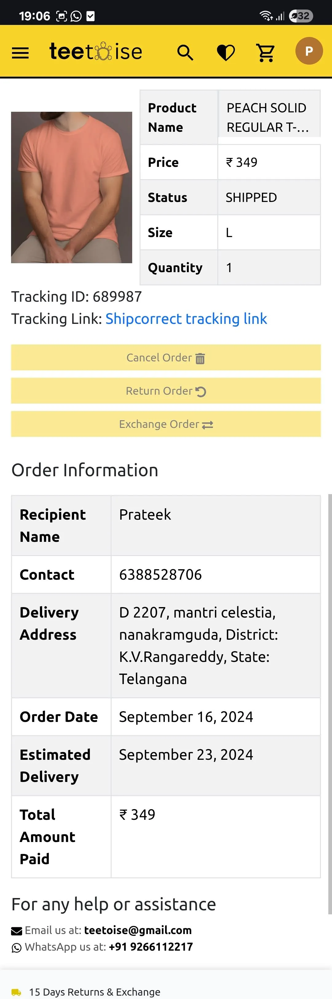

### User Account Details

Profile settings and address management. 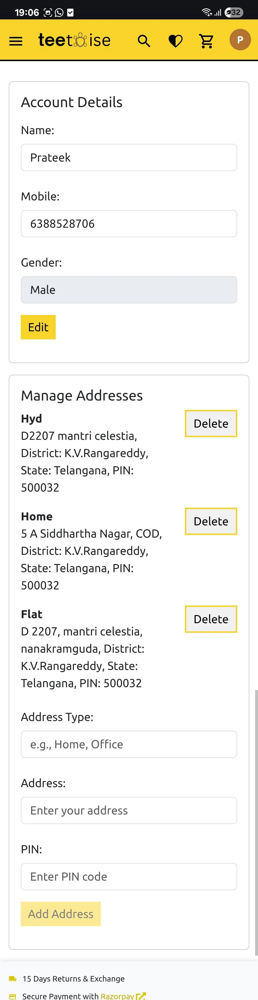

### About Us

Static page with brand mission and story. 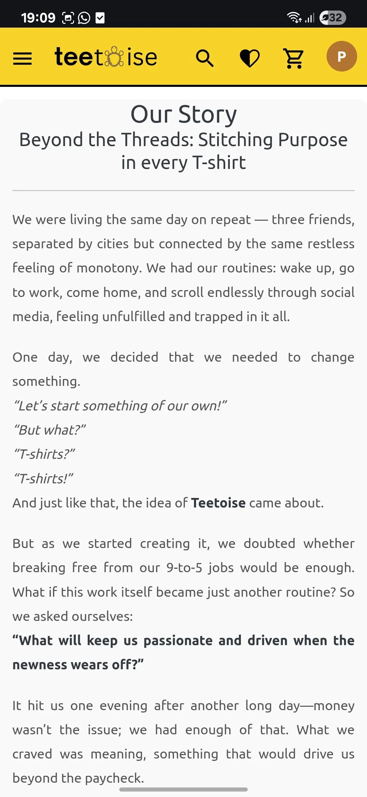

### FAQs

Frequently asked questions section. 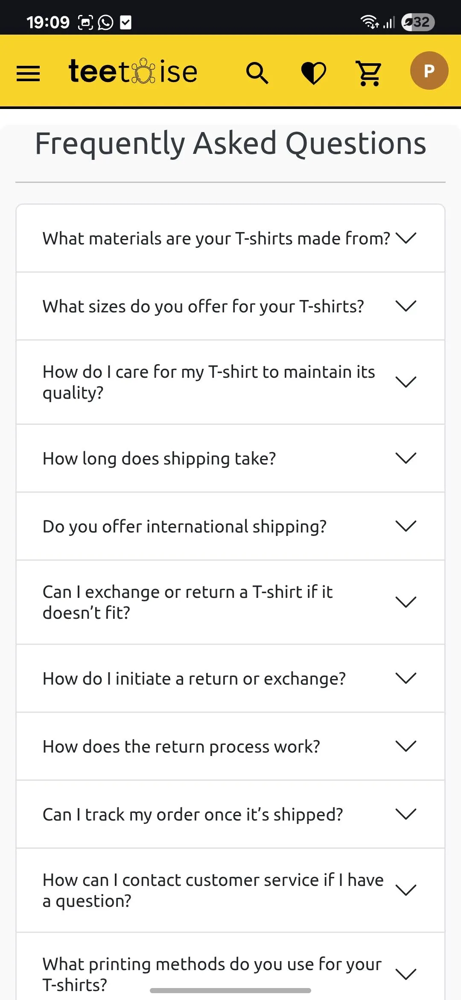

---

## Features & Pages

- **Homepage**: Hero banner, featured/trending products, new arrivals sections
- **Product Listing**: Filter and sort by category, price, popularity
- **Product Details**: Image gallery, size chart, add to cart/wishlist
- **Wishlist & Cart**: CRUD operations synced with the backend
- **Checkout Flow**: Address summary, Razorpay integration, SKU validation
- **Order Management**: Order confirmation, view/cancel/return/exchange
- **User Account**: Profile management, order history, password update
- **Blog**: List of articles and detailed view
- **Static Pages**: Terms of Service, Privacy Policy, Shipping Policy, FAQ, Contact Us, About Us
- **Authentication**: Sign up, login, social login, password reset
- **Admin Screens**: Developer portal and admin login stub
- **Performance**: Lazy loading, code splitting
- **SEO**: Dynamic titles and meta tags via React Helmet
- **Notifications**: Toast messages for form submissions and actions
- **Error Handling**: Global Error Boundaries and 404 page

---

## Notes

- You can customize image sizes with `width` and `height` attributes for optimal control.
- If serving from a CDN or different domain, adjust image paths accordingly.
