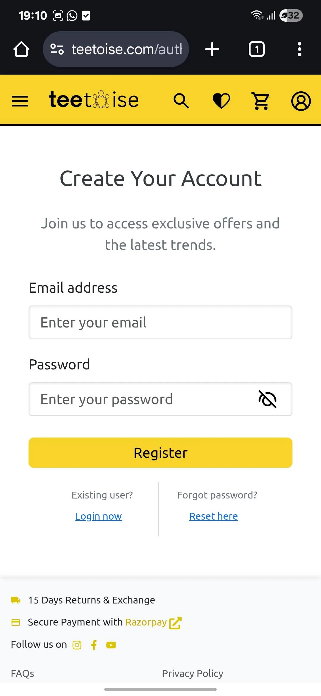
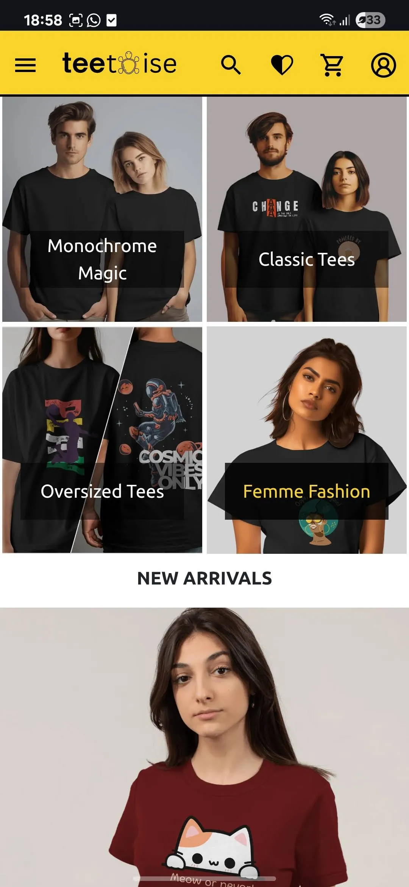
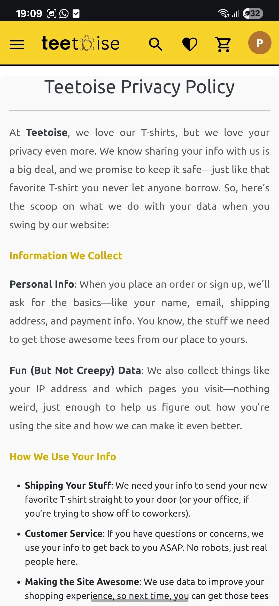
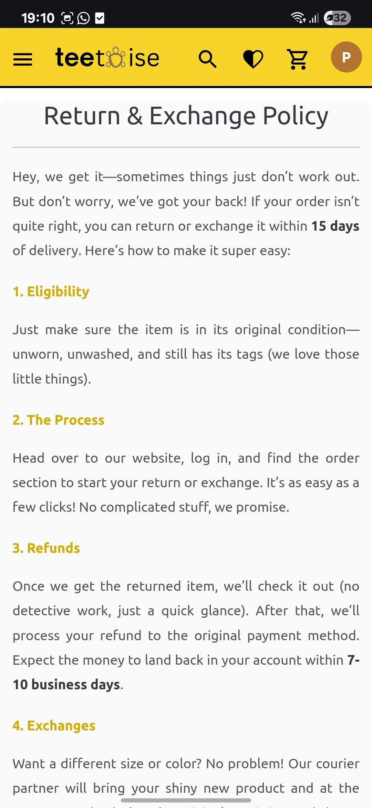
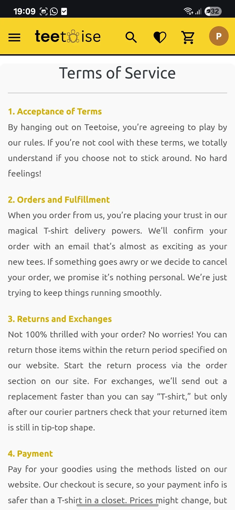

# Teetoise Frontend

> **Responsive, SEO-optimized React application for a scalable e-commerce platform.**

---

## Tech Stack

- React (v18)
- Redux Toolkit for state management
- React Router v6 for routing
- Axios with a centralized instance and interceptors
- React Helmet for dynamic `<head>` tags (SEO)
- React.lazy & Suspense for code splitting and lazy loading
- React-Toastify for in-app notifications
- SCSS modules for styling
- AWS Amplify & Google Cloud Storage for asset hosting
- Custom Error Boundaries for graceful error handling
- Utilities: ScrollToTop, SessionExpired handler

---

## Installation

1. **Clone the repository**

```bash
git clone https://github.com/Raj0168/teetoise-frontend.git
cd teetoise-frontend
```

2. **Install dependencies**

```bash
npm install
```

3. **Set up environment variables**
   Create a `.env` file in the root:

```ini
REACT_APP_API_BASE_URL=https://api.teetoise.com
REACT_APP_ASSETS_URL=https://storage.googleapis.com/your-bucket
```

4. **Run in development mode**

```bash
npm start
```

5. **Build for production**

```bash
npm run build
```

---

## Repository Structure

```
src/
├── components/         # Reusable UI components
│   ├── commons/        # Header, Footer, SessionExpired, ErrorBoundary
│   ├── home/           # FeaturedProducts, NewArrivals, ShopByOccasion
│   ├── payment/        # PaymentButton, displayRazorpay
│   ├── product-details/# TermsOfService, ReturnAndExchange, FAQ, etc.
│   └── blogs/          # BlogPage, BlogDetailsPage
│
├── pages/              # Route-level pages
│   ├── HomePage.js
│   ├── ProductsPage.js
│   ├── ProductDetailsPage.js
│   ├── WishlistPage.js
│   ├── CartPage.js
│   ├── AddressAndOrderSummary.js
│   ├── OrderConfirmationPage.js
│   ├── UserOrdersPage.js
│   ├── OrderDetailsPage.js
│   ├── PaymentFailedPage.js
│   ├── AuthPage.js
│   ├── YourAccount.js
│   └── admin/          # DeveloperPortalPage, AdminLogin
│
├── redux/              # Redux slices and store
│   ├── slices/         # productsSlice.js, userSlice.js, orderSlice.js, etc.
│   └── store.js        # Redux store configuration
│
├── utils/              # Utility functions
│   ├── axiosInstance.js# Axios base instance with interceptors
│   ├── ScrollToTop.js  # Scroll restoration component
│   └── errorBoundary.js# Custom error boundary component
│
├── App.js              # Application root, Router, Layout, Helmet
└── index.js            # Entry point
```

---

## Core Features and Pages

### Homepage

- Hero banner with featured promotions
- Trending products and new arrivals

### Product Listing

- Filter and sort by category, price, and popularity
- Real-time pagination and lazy loading

### Product Details

- Zoomable image gallery
- Size and stock availability
- Add to cart/wishlist actions

### Wishlist & Cart

- Add/remove items from wishlist or cart
- Auto-update on variant or quantity change

### Checkout Flow

- Address selection and summary
- Razorpay integration
- Order placement with validation and error handling

### Order Management

- View past orders
- Request cancellations, exchanges, or returns
- Order confirmation with detailed summary

### User Account

- Profile details and password update
- Address book and order history

### Authentication

- Login, Signup, Forgot Password
- Google OAuth integration

### Static Pages

- FAQs, About Us (Terms, Returns, Privacy are optional)

### Admin Portal (Stub)

- Developer login and portal access placeholder

### Performance

- Code-splitting via React.lazy
- Lazy loading images and routes

### SEO

- Dynamic page titles and meta descriptions with React Helmet

### Notifications

- Form and action responses via toast notifications

### Error Handling

- 404 not found page
- Global error boundary wrappers

---

## UI Screenshots

### Login / Register




### Home Page




### Sidebar Navigation


### Product Browsing


### Wishlist & Cart


### Checkout & Payment


### Order Management


### User Account


### Additional Pages


<!-- Optional Pages



-->

---

## Deployment & Hosting

- Hosted using **AWS Amplify** (static hosting)
- Assets served from **Google Cloud Storage (GCS)**
- Connected to backend APIs via secure environment variables

---

## Contribution & Feedback

For feedback or suggestions, open an issue or contact at \[[teetoise@support.in](mailto:teetoise@support.in)]

---
